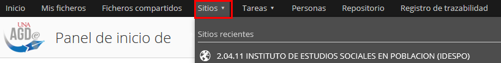
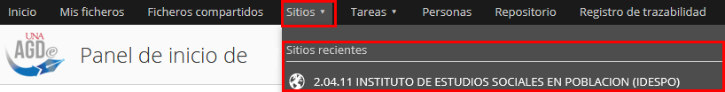
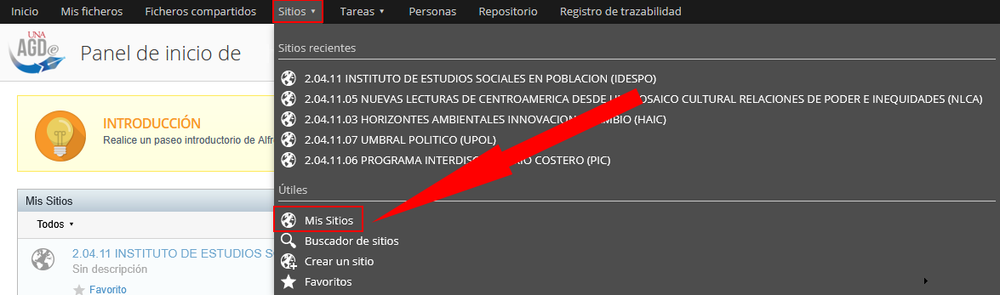
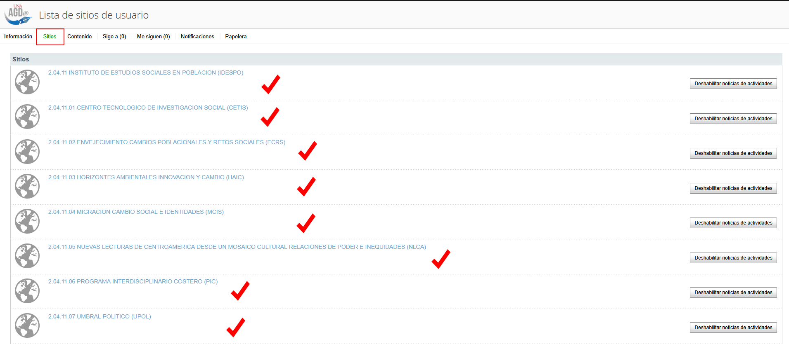
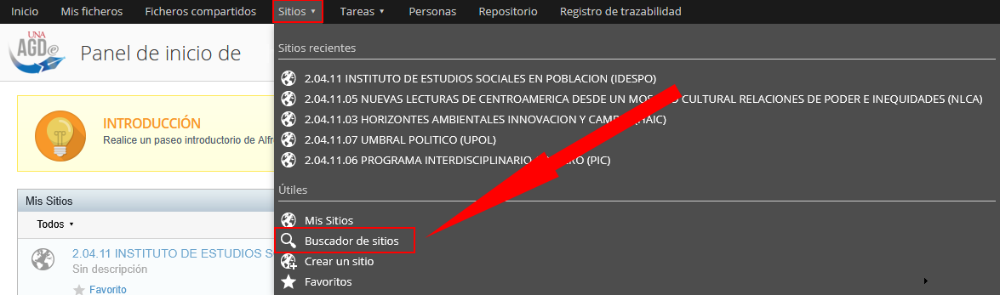
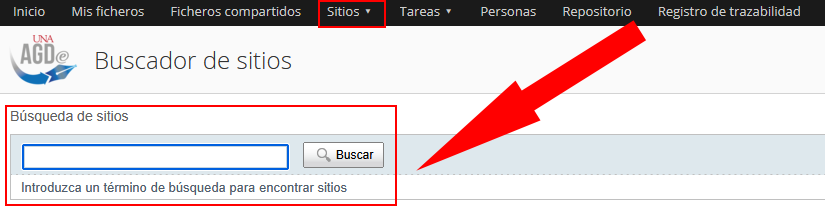
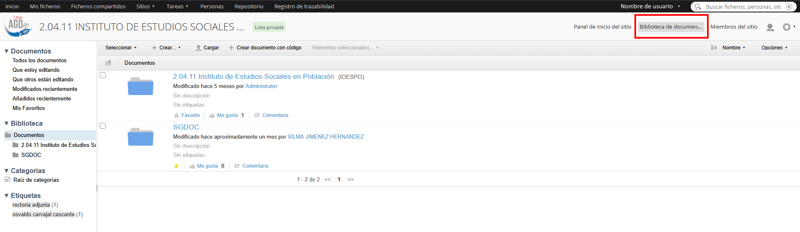
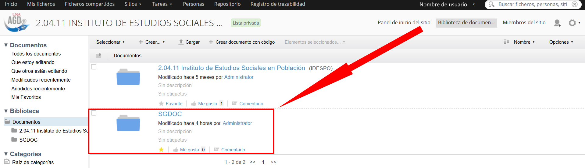

## Visualización de la instancia dentro del Sistema AGDe

1. Una vez ingresado al sistema, seleccione la pestaña **"Sitios"** ubicada en el menú principal, en la parte supeior de la pantalla.

    

2. En este apartado, vera que dice **"Sitios recientes"** se mostraran los nombres de las ultimas instancias visitadas, al final del nombre encontrara el código asignado.

    

3. Si su instancia no se encuentra entre los recientes, puede utilizar las siguientes opciones:
    1. **Mis sitios**: En esta sección apareceran todos los sitios a los cuales tiene acceso, así como a los sitios colaborativos oficiales de los cuales forma parte.
    
        

        
    
    2. **Buscador de sitios**: Utilice la barra de búsqueda para localizar el sitio de su instancia, ya se por nombre, siglas o el identificador único correspondiente.
    
        

        

## Ingreso a la instancia seleccionada
   
1. Ingrese al sitio colaborativo y diríjase a la pestaña **"Bibloteca de documentos"** y de clic.

    

2. Una vez dentro del sitio vera las siguientes carpetas.

    

## ¿En cuál carpeta debo trabajar dentro del Sistema AGDe?

Se debe trabajar en la carperta nombrada **"SGDOC"**

## ¿Qué sucede con la carpeta que contiene el codigo y nombre de la instancia?

Esta corresponde a la carpeta anterior **(carpeta vieja)**, la cual se utilizaba en el repositorio. Se mantiene unicamente para efectos de consulta de documentos.
No obstante, dicha carpeta **no permite la ejecución del flujo de trabajo**, por lo que **no aplica las reglas necesarias para la recepción de documentos**.